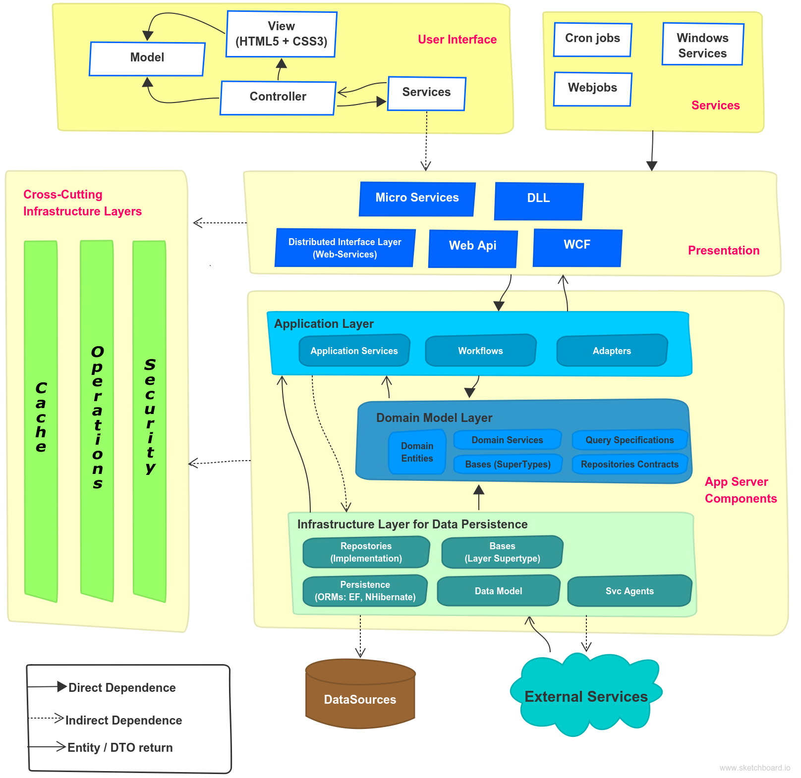

Architecture
============

This project was developed aiming the best practices. 

Equinox Project
---------------
The ASP.NET Core Architecture was based on `Equinox Project <https://github.com/EduardoPires/EquinoxProject/>`_. 

Angular 6
---------

To manage existing user and new one's a SPA Angular 6 was created. But instead begin of nothing, the `CoreUI <https://github.com/coreui/coreui-angular>`_ Admin was used.

Application Insights ready
--------------------------

You can monitor Application in production ambient with Application Insights.

Technologies
-------------

These Technologies was used to build app

DDD
^^^

ASP.NET CORE
^^^^^^^^^^^^

* Full architecture with responsibility separation concerns, SOLID and Clean Code
* Domain Driven Design (Layers and Domain Model Pattern)
* Domain Events
* Domain Notification
* CQRS (Imediate Consistency)
* Event Sourcing
* Unit of Work
* Repository and Generic Repository
* Serilog

Angular 7
^^^^^^^^^^

* OpenId Connect throug angular-oauth2-oidc plugin to manage login.
* Bootstrap 4
