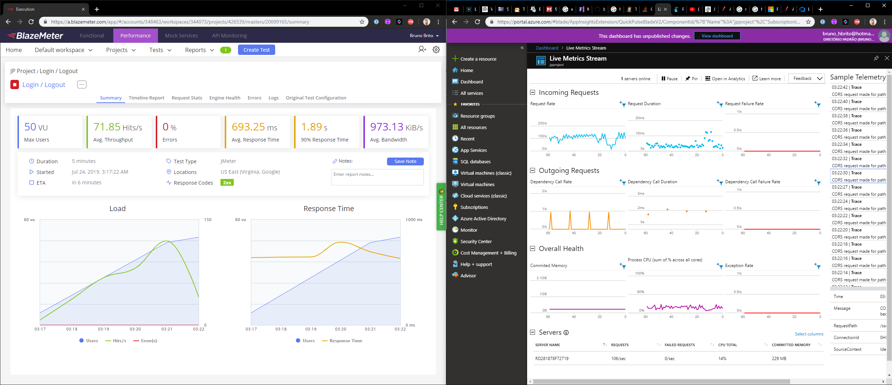
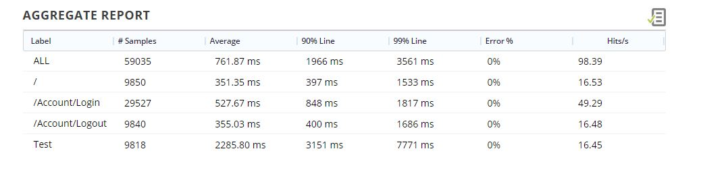

Stress Tests Results
====================

The stress file was created with JMeter and executed in Blazemeter. The results was described below.

Scenario
--------

The test scenario is described below

Script Steps
^^^^^^^^^^^^

The steps of testing was:
 1. Load Login page
 2. Login
 3. Load Home page
 4. Load Logout page
 5. Logout
 6. Load login page

Machine config:
^^^^^^^^^^^^^^^

Azure B1, it's the most basic Machine of Azure.
 * 100 ACU
 * 1.75gb Memory

The database was Azure SQL with 5 DTU's (most basic)

Blaze Meter Results
--------------------

 * 50 v-Users
 * 10 minutes

During tests, average CPU utilization was 13,58% and Memory consumption was about 230mb.

.. image:: ../images/stress/cpu.jpg

Timeline report
^^^^^^^^^^^^^^^

.. image:: ../images/stress/timelinegraph.jpg

Aggregate report
^^^^^^^^^^^^^^^^

Result file
^^^^^^^^^^^^
Blazer meter `Results <https://a.blazemeter.com/app/executive-summary/index.html?master_id=20009165#/>`_
