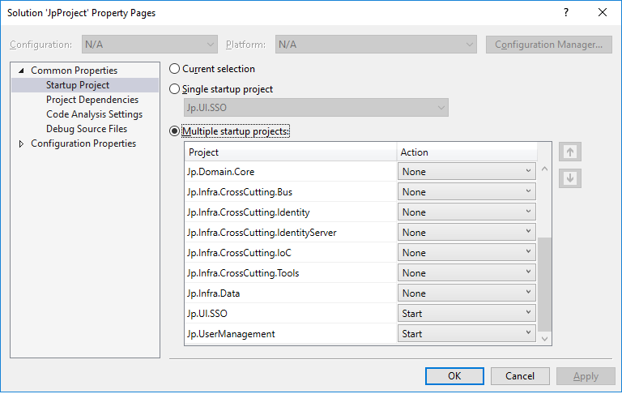

VS and VSCode
===============

The default way to Start the project.

SSO and API
^^^^^^^^^^^
To load project open src/JpProject.sln vith Visual Studio. Now you need to set Multiple Startup Projects.

Run the project

Admin UI
^^^^^^^^^^^^^^^

Open VSCode then go to File > Open Folder > Locate src\Frontend\Jp.AdminUI.

Open Terminal :kbd:`CTRL` + :kbd:`'`. Type: 

* npm install
* ng serve

Wait and open Browser at http://localhost:4300

User Management
^^^^^^^^^^^^^^^

Open VSCode then go to File > Open Folder > Locate src\Frontend\Jp.UserManagement.

Open Terminal :kbd:`CTRL` + :kbd:`'`. Type: 

* npm install
* ng serve

Wait and open Browser at http://localhost:4200

.. raw:: html

    

        <iframe src="https://player.vimeo.com/video/288762840?color=ff9933&title=0&byline=0" width="800" height="350" frameborder="0" webkitallowfullscreen mozallowfullscreen allowfullscreen></iframe>
    

Expected
--------

After a success build and run, 3 consoles app's must be open:

.. raw:: html

   
   
   
